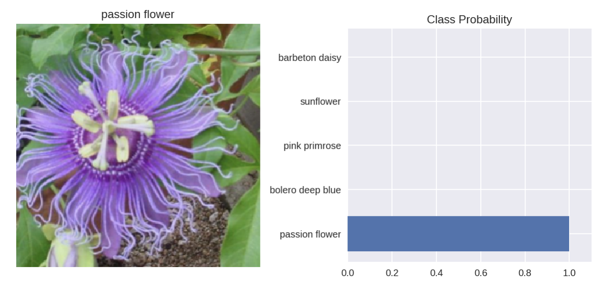

# Flower Classifier

This project is due to the [PyTorch Scholarship Challenge](https://sites.google.com/udacity.com/pytorch-scholarship-facebook/phase-1-archived/phase-1-home)
made by Facebook and Udacity. After 2 months of classes, the scholars should submit a final project. This project was
based in creating a classifier to identify 102 different species of Flowers based on the dataset from the [University
of Oxford](http://www.robots.ox.ac.uk/~vgg/data/flowers/), which contains over 6,000 images. My approach to the 
challenge was developed using [PyTorch](https://www.pytorch.org), Facebook's Deep Learning Framework, and this was my
first project using this framework.

    

## Approach

First things first, before choosing which model to go for it I decided to take a look at the dataset and how I could
made it stronger. To make our model (whichever model we want) more robust, we need to make it predict the 
flower's species regardless of the orientation and photo quality. To produce a stronger-variant model, we've used the
[Image Augmentation](http://cs231n.stanford.edu/reports/2017/pdfs/300.pdf) technique, making the training images tilt,
flip and random cropping them. 

To have a better performance on the image classification task, I've chosen to go for [transfer learning](http://cs231n.github.io/transfer-learning/)
and since PyTorch's computer vision library, [torchvision](https://pytorch.org/docs/stable/torchvision/index.html), 
provides a [bunch of pre-trained](https://pytorch.org/docs/stable/torchvision/models.html) Convolutional Neural Networks
on [ImageNet](http://www.image-net.org/) for us, the first thing to do was to choose which one should I pick. 

The chosen architecture was [ResNet](https://arxiv.org/abs/1512.03385) on its version with 152 layers. To make this 
giant network work on our project, first we need to froze the entire feature extractor (the *conv layers*) and then 
we should change the classifier (the **MLP** by the end of the model) to fit our classes. 

With all the changes made, the training took place on the [Google Colaboratory](https://colab.research.google.com/) 
environment, which gives us unlimited GPU training! Our kernels must not be running for more than 12 hours in a row, but
it's enough for this task. Both the notebooks on this repository (`prediction.ipynb` and `flower-classifier.ipynb`) are
ready to run on Colab (especially now that Colab has native support of PyTorch 1.0.0). After 100 epochs of training with
[Adadelta](https://arxiv.org/abs/1212.5701) optimizer function (with starting learning rate of 0.1) the model got 
$\mathbf{93.63\%}$ accuracy on the validation set. 

This was achieved by only fine tuning the classifier of the model, the *feature extractor* (a.k.a. the *conv layers*)
remained the same as the one trained to perform the **ImageNet task**. What if the *feature extractor* was a little bit
different? More specific to the flower classification task? To check this, it was made a second training on the model,
but this time with the entire model trainable (including the *conv layers*). There are a couple of things to be 
concerned on this training:

* The parameters of the *conv layers* were trained extensively on multiple GPUs and for much more time that we are
willing to train, so they are pretty good... We need only to get them a little better and more specific for our task, so
we need to keep our learning rate really small to avoid huge changes.

* Now that we are training the entire network we need to take care of the GPU's memory. Google gives us unlimited GPU
time, but not unlimited GPU memory, so since we are *backpropagating* through a lot more layers we need to free a little
bit of memory, so it's recommended that the *batch size* on this second part should be smaller.

With this and a little more epochs, our model achieved $\mathbf{98.92\%}$! Pretty good accuracy on more than 102 
different classes. All the code of how I implemented this is on the `flower-classifier.ipynb` notebook, and you can
download the Pytorch checkpoint model from [this link](https://drive.google.com/uc?export=download&id=1UJW1XcXTjgrFulKDoLnSOOy9O3LtdgEr)
and use the `resnet()` and `load_pretrained_model()` functions on the `prediction.ipynb` to run this model on your computer.

## Predictions

On the `utils.py` file you can find a couple of functions that would give you an easy way to make (and show) predictions
using the output model from this repository. An example of how this prediction could be would be:

